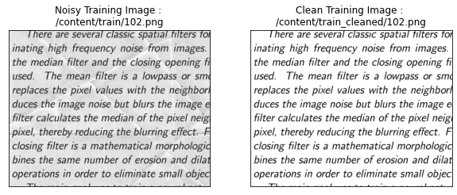
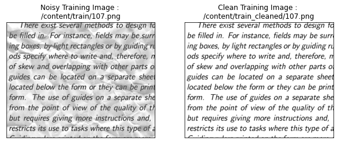
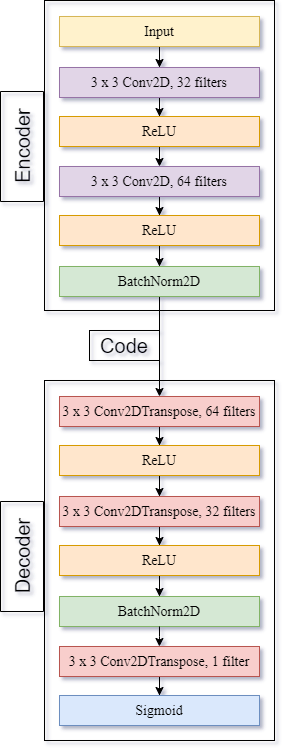
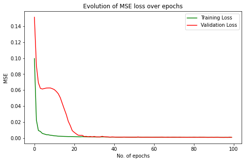
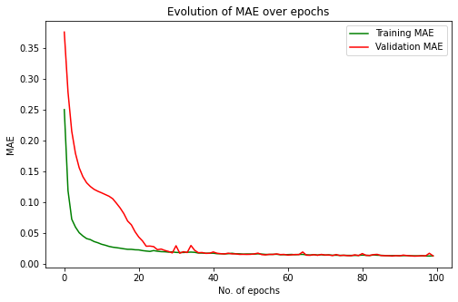
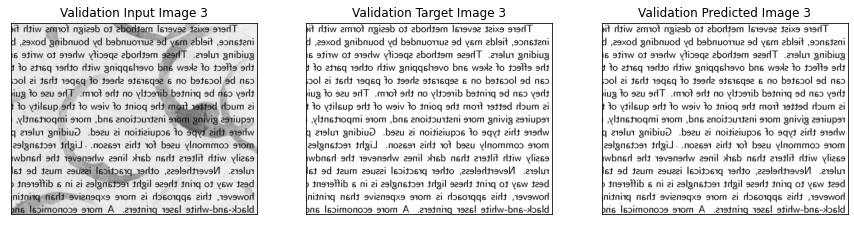
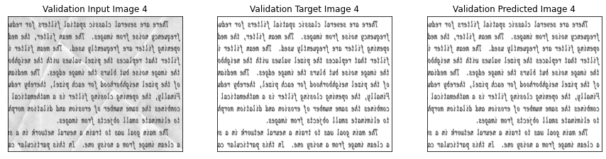
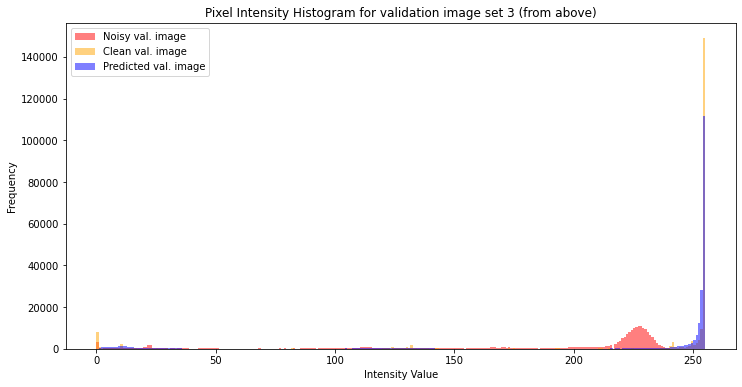
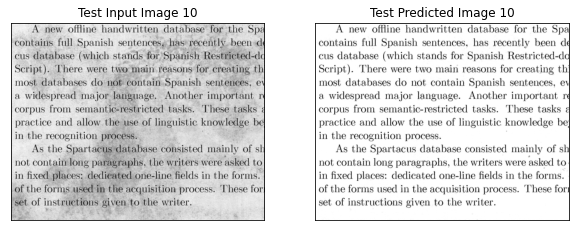
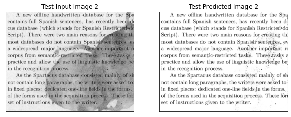

# Removing background noise of text documents using denoising autoencoder

**Project Report by Anubhab Das** 

Date : 10th April, 2021

[](https://nbviewer.jupyter.org/github/anubhabdaserrr/document-denoising-autoencoder/blob/main/doument_denoising_autoenc_nb.ipynb)
[](https://colab.research.google.com/github/anubhabdaserrr/document-denoising-autoencoder/blob/main/doument_denoising_autoenc_nb.ipynb)

## Objective & data

The goal in this mini-project was to build a model that can remove the content of the background and retain the textual part of the document - which is, in the context of the given data, coffee stains, textures due to crumpes & folds. An autoencoder is suitable for this purpose and specifically, we use a convolutional one since they're known to give great performance with image data.

Data Source : [Link](https://www.kaggle.com/c/denoising-dirty-documents/data)




**Note : In the context of this project, denoising refers to removal the content of the background (which may not necessarily be "noise" but is treated in this work as such) to successfully extract the foreground text.**

## Model & Training details

### Convolutional Autoencoder Architecture


### Training details
```
Optimizer : Adam with mini-batch gradient descent
beta1 : 0.999 (default)
beta2 : 0.999 (default)
Learning rate : 0.01 (default) 
Loss : Mean Squared Error
Validation Metric : Mean Absolute Error
Mini batch size : 32
No. of epochs : 100
```

Mean Squared Error (MSE) loss function has been used becuase it squares the distance between real & predicted data. Therefore, it penalizes larger errors more than it does smaller ones.

However, for model validation, MSE might not be appropriate since it exaggerates the effect of big differences. For this purpose, Mean Absolute Error or MAE will be more appropriate. (Even compared to RMSE, because MAE is easier to interpret)

### Data Augmentation

Transformations applied : various degrees of rotation, Horizontal & vertical flipping.

144 pairs of noisy & corresponding clean images were augmented to obtain 1152 instance pairs.

### Train-Validation Split

**Note : The validation set basically serves as the test set since a separate dataset wasn't need to tune hyperparameters.**

Out of 1152 instances (post-augmentation), 1052 instances were used for training & remaining 100 (9.5%) for validation.

## Evaluation & test performance

### Loss Curves :
 

The model seems to have converged right after 20 epochs.

### Validation Predicted & Actual Images :




### Validation Images Pixel Intensity Histograms :



From these histograms, it's evident that the noisy images have a much wider distribution of pixel values - which is expected, because of all the textures in the background. However, the histograms for validation & predicted images are similar to a large extent. This is indivative of the fact that our model is performing as expected. It's interesting to note that, the histogram for the validation images are taller than the predicted images. The validation images contain clean backgrounds with only the textual foreground. Hence, the non-0 pixel values represent pixels with has textual information. Even though, the model is doing a good job removing the background, some of it still remains. Hence, the predicted pixels histogram is a little wider than the validation pixels histogram. This also suggests some room for further model improvement.

### Denoising unseen test images :

 
 

The model seems to be performing well on text data. (There's no way to find an objective measure because the clean text images are unavailable.)

## Limitations and further improvements :
1. The background content is purely synthetic and thus it doesn't reflect the sort of messy artifacts in the real world.
2. Typed text is easier to perform denoising on, because it's well-structured. The font stands out from the background really well. The scope of the model can be extended to handwritten text & blurry text where it's difficult to separate the background from the textual content.
3. This model doesn't discriminate between actual background content (if any, which there isn't for the dataset) and noise. It would be beneficial if a model could remove noise without removing actual background content like images, logos & watermarks. Additional experiments are needed with data containing the aforementioned features to comment on whether small autoencoders has the capacity of doing this or whether we need much more complex models to achieve this.

## References
1. [Denoising Convolutional Autoencoder](https://towardsdatascience.com/convolutional-autoencoders-for-image-noise-reduction-32fce9fc1763)
2. [MAE vs MSE](https://www.kaggle.com/c/home-data-for-ml-course/discussion/143364)
3. [Pixel Intensity Histograms](https://towardsdatascience.com/histograms-in-image-processing-with-skimage-python-be5938962935)
