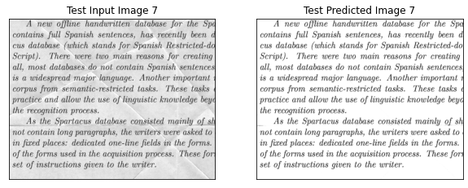

# Removing background noise of text documents using denoising autoencoder

**Project Report by Anubhab Das** 

Date : 10th April, 2021

[](https://nbviewer.jupyter.org/github/anubhabdaserrr/document-denoising-autoencoder/blob/main/doument_denoising_autoenc_nb.ipynb)
[](https://colab.research.google.com/github/anubhabdaserrr/document-denoising-autoencoder/blob/main/doument_denoising_autoenc_nb.ipynb)

## Objective & data


**Note : In the context of this project, denoising refers to removal the content of the background (which may not necessarily be "noise" but is treated in this work as such) to successfully extract the foreground text.**

## Model & Training details

### Convolutional Autoencoder Architecture


### Training details
```
Optimizer : Adam with mini-batch gradient descent
beta1 : 0.999
beta2 : 0.999
Learning rate : 0.01 
Loss : Mean Squared Error
Validation Metric : Mean Absolute Error
Mini batch size : 32
No. of epochs : 100
```

## Evaluation & test performance

### Loss Curves :
 

### Validation Predicted & Actual Images :


### Validation Images Pixel Intensity Histograms :


### Denoising unseen test images :

 
 

## References
Links go here
